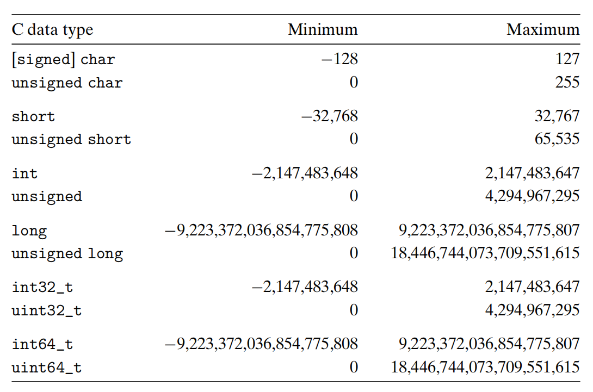
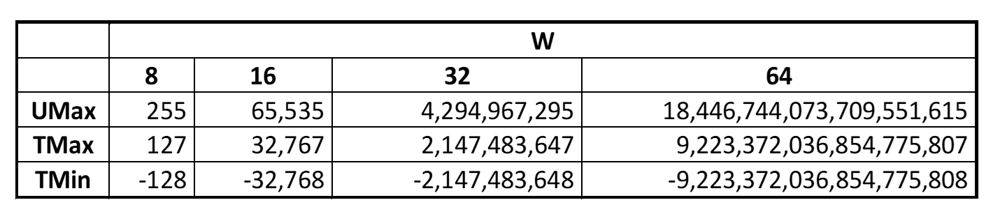
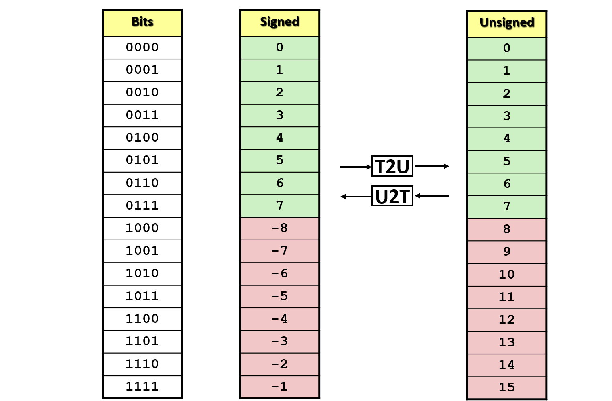
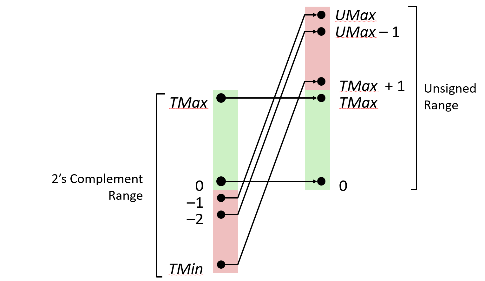
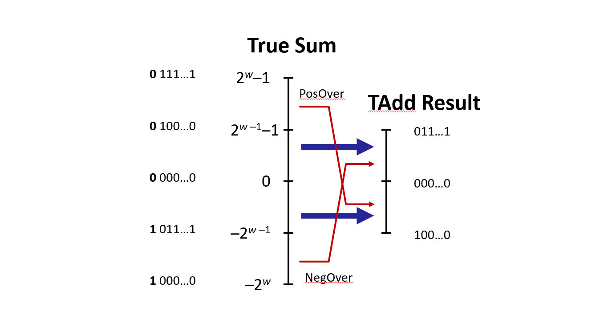
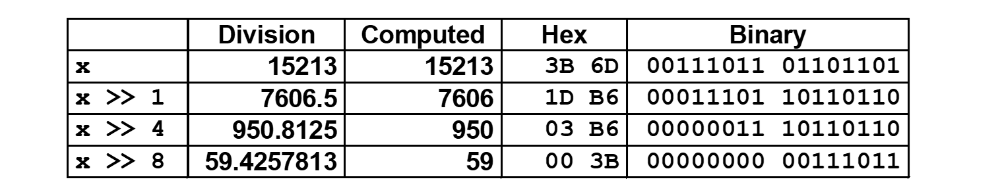

> CSAPP是所有计算机专业的学生和程序员必读的书，我自己直到读了这本书后，才认识到之前对于C语言和计算机的认识有多么浅薄。因此我想把自己读完这本书和听完CMU-213的公开课后的理解写成笔记分享给大家。

## 数据的机器级表示

*注：本篇文章默认读者已了解基本的数据单位（bit, byte）,位运算以及不同进制之间的转换，因此不再对这些概念进行解读*

我们可以暂且认为数据在计算机中的表示方式为一个由0和1组成的数组。

### 位运算（Bitwise Operations）

C语言中基本的位运算有`&` `|` `~` `^` `<<` `>>`。我想重点讲一下移位操作，

##### 左移（Left Shift）`<<`

- 把所有位向左移动x格，丢掉左边溢出的位，右边用0补全，比如 `01100010 << 3 == 00010000`

##### 右移（Right Shift）`>>`

- 所有位向右移动x格，丢掉右边溢出的位，左边补全有两种方式：
  - Logical Shift：左边用`0`补全。
  - Arithmetic Shift：用原先左边最高位补全，比如 `10100010 >> 3 = 11110100`, `01100010 >> 3 == 00001100`。

C语言中对于有符号整数，右移使用`Arithmetic Shift`，无符号整数右移使用`Logical Shift`。

移位的距离小于`0`或大于等于一个字长（32位系统为`4 byte`，64位系统为`8 byte`）是未定义的。在大多数系统上，移位距离大于等于一个字长时，计算机会先把移位的距离模上字长，然后再移位，比如在`32`位系统中:

```c
int      a = 0xFEDCBA98  << 32;
int      b = 0xFEDCBA98  << 36;
unsigned c = 0xFEDCBA89u >> 40;

a == 0xFEDCBA98 // 32 % 32 = 0
b == 0xFFEDCBA9 // 36 % 32 = 4，有符号整数使用 Arithmetic Shift
c == 0x00FEDCBA // 40 % 32 = 8，无符号整数使用 Logical Shift

```

### 整数（Integer）

C语言对于**有符号整数**和**无符号整数**都定义了相应长度的数据类型。



#### 无符号整数（Unsigned Integer）

无符号整数可以直接转换为二进制，比如用`8 bit`可以表示 $2^8$ 个数，即 `00 00 00 00` 到 `11 11 11 11` (0-255)。对于一个`w`位的`unsigned int`，能够表示的范围是 $0$-$2^w-1$，我们记他的最大值为 $UMax_w$（每一位都为1）。每一个在范围中的数都有唯一的 Binary Number 与其对应。

#### 有符号整数（Signed Integer）

绝大多数的机器都采用**补码** **Two's Complement Encoding** 的方式表示有符号整数，即最高位的权重变为 $-2^{w-1}$ （称为 sign bit），其它位的权重不变。对于一个 $w$ 位的有符号整数：
- 正数
  - 0为所有位都为`0` (`0000`)
  - 最大的正数为最高位为`0`，其余位为`1` (`0111`)，记为 $TMax_w = 2^{w-1}-1$
- 负数
  - 最小的负数为最高位为`1`，其余位为`0` (`1000`)，记为 $TMin_w = -2^{w-1}$
  - 最大的负数（-1）为所有位都为`1` (`1111`)
对于一个用**补码**表示的有符号整数，sign bit 为`0`即为正数，`1`即为负数。

以下是不同长度的整数能表示的范围：

- $|TMin| = TMax + 1$ （有符号整数的表示范围并不是关于原点对称的）
- $UMax = 2 * TMax + 1$

> 使用**补码**的好处
> - `0`只有一种表示方式，没有重复
> - 有符号和无符号整数的加减操作是统一的
> - 取一个数的负数只需翻转所有bit并加1

#### 无符号整数和有符号整数之间的转换

<span style="color: orange;">**Signed 和 Unsigned 之间的转换不改变数据，只改变数据的解析方式**</span>

举个例子，将一个有符号整数的负数转换为无符号整数:
```c
char a = 0x9D; // 1001 1101  （-99）
unsigned char b = (unsigned char)a; // 依旧是 1001 1101，但b变成了157
```
一个负数经过**无符号->有符号**的转换后变为了一个*很大的正数*。



从这张图我们可以看出对于 Signed，**正数部分**直接对应 Unsigned，而**负数部分**变为了在整数部分之后的更大的正数，`-1`经过转换之后变为的最大的正数`15`。从下图可以更清楚地看出其**对应关系**：


  
> **在C语言中我们往往会忽视 Signed 和 Unsigned 带来的 bug：**
> - 常数默认为 Signed，带有后缀`U`的为 Unsigned，比如`123456U`
> - 可以使用`()`来显式转换，但在赋值过程中也会发生隐式转换，比如
> ```c
> int tx, ty; unsigned ux, uy;
> tx = ux; uy = ty; // 发生隐式转换
> ```
> - <span style="color: orange;">**如果在一个表达式（包括比较`<`, `==`等）中既有Signed又有Unsigned，则所有Signed隐式转换为Unsigned**</span>，比如以下表达式都是成立的：
> ```c
> -1 > 0U   // Unsigned比较
> 2147483647 > -2147483647-1
> 2147483647U > -2147483647-1      // Unsigned比较
> 2147483647 > (int)2147483648U    // Signed比较
> (unsigned)-1 > -2
> ```

*为什么要将 $TMin$ 表示为 `-2147483647-1` 而不是 `-2147483648` 可以参考这篇文章 https://csapp.cs.cmu.edu/2e/waside/waside-tmin.pdf*

#### 不同长度的正数之间的转换

##### 扩展（Expanding）：增加长度

- 对于**无符号整数**，直接在前面补上`0`，不改变数值。（Zero Extension）
- 对于**有符号整数**，在前面补上原本最高位的值，可以自行证明同样也不会改变原先的数值。（Sign Extension）

##### 截断（Truncating）：减少长度

- 对于**无符号整数**和**有符号整数**，直接丢掉溢出的位，对于较大的数数值可能改变，对于有符号整数其正负性也可能会改变。

#### 整数运算

##### 加法

通过观察不难发现，两个 $w$ 位的二进制数相加，最多可能得到 $w+1$ 位的结果，但数据类型只能存 $w$ 位，需要丢掉最高位。也就是说，如果两个较大的数相加，我们可能会得到错误的结果，这就是**溢出**（Overflow）。可以用如下表达式表示加法：
$$s=Add_w(u,v)=u+v\space mod\space 2^w$$

**有符号整数**和无符号整数的加法有着相同的位运算。有符号整数不仅会在正数上界有正溢出（Positive Overflow）的可能，变成一个负数；当两个负数相加时还有可能超过下界造成负溢出（Negative Overflow）变成一个很大的正数。



##### 减法

减法可以看做一个数加上另一个数的相反数，与加法类似。

##### 乘法

- 两个 $w$ 位的二进制数相乘，最多可能得到 $2w$ 位，超出范围的位都要丢掉。
- 无符号和有符号整数依旧有着相同的位运算。
- 有符号整数乘法的Overflow同样可能会**改变正负**。

> 这里有一个很有用的小技巧：对一个数左移位相当于乘以2的次方
> `u << k` 相当于 $u*2^k$ (Signed,Unsigned都可用)
> - 位运算比乘法更快
> - 大多数编译器会自动检测，并帮你自动改写
> 同样，对于**无符号整数**，右移相当于除以2的次方（并取下整）`u >> k` 相当于 $\lfloor u/2^k\rfloor$，如图：



#### 务必小心Signed和Unsigned的带来的Bug！

如果不了解Signed和Unsigned的具体原理，很容易就写出有问题的程序，比如：
```c
for (unsigned i = cnt - 2; i >= 0; i--) a[i] += a[i + 1];   // i会变成很大的数，造成Seg Fault


#define DELTA sizeof(int)
for (int i = CNT; i - DELTA >= 0; i -= DELTA) {}    // 死循环，sizeof返回无符号整数
```